# Practical 3: Cache-Aside Pattern using AWS RDS & ElastiCache

---

## 🎯 Objective

To reduce database load and improve performance using Redis caching with Amazon RDS.

---

## 🏗️ Architecture

```
EC2 (Python App)
       ↓
Redis (ElastiCache)
       ↓
RDS MySQL
```

---

# 🧾 PART 1: AWS SETUP

---

## ✅ Step 1: Create RDS (MySQL)

* Engine: MySQL
* DB Name: `database-1`
* Username: `mitesh`
* Public Access: ❌ NO
* Encryption: ✅ Enabled

📸 Screenshot:
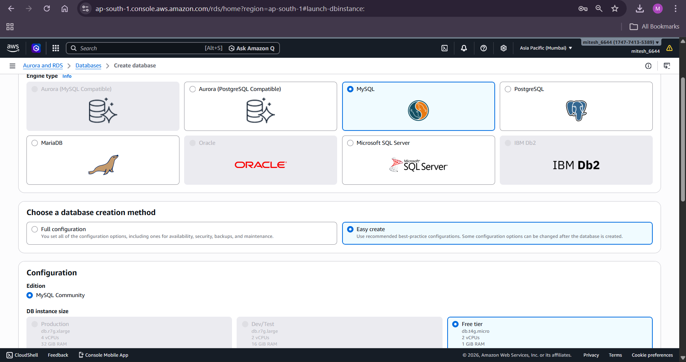

---

## ✅ Step 2: Create Redis (ElastiCache)

* Cluster mode: Disabled
* Node type: cache.t2.micro
* Encryption in transit: ✅ Enabled
* Encryption at rest: ✅ Enabled

📸 Screenshots:
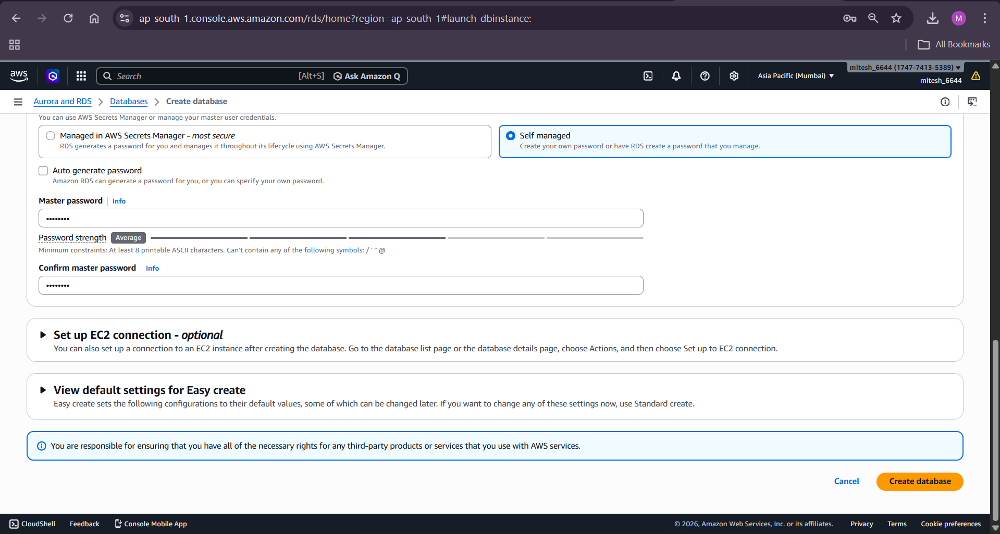
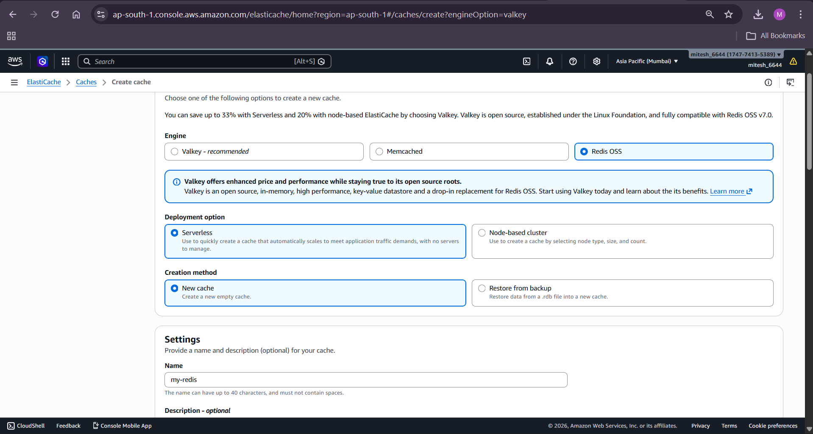

---

## ✅ Step 3: Create EC2

* Amazon Linux
* SSH enabled

📸 Screenshot:
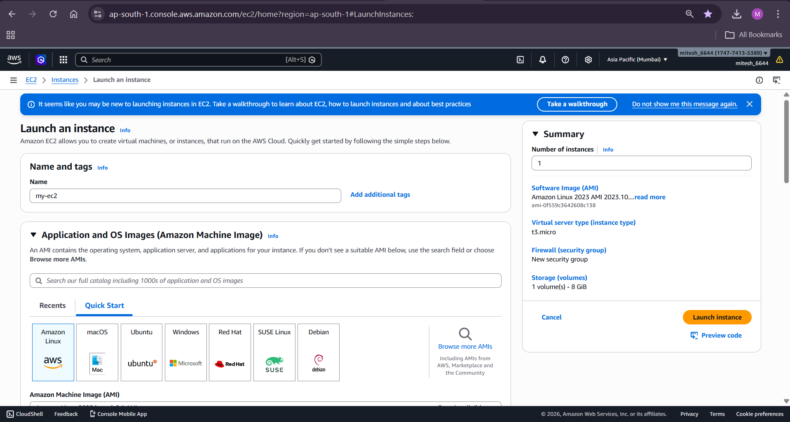

---

# 🔐 PART 2: SECURITY GROUP

---

## ✅ Configure Inbound Rules

| Service | Port | Source |
| ------- | ---- | ------ |
| RDS     | 3306 | EC2 SG |
| Redis   | 6379 | EC2 SG |

📸 Screenshot:
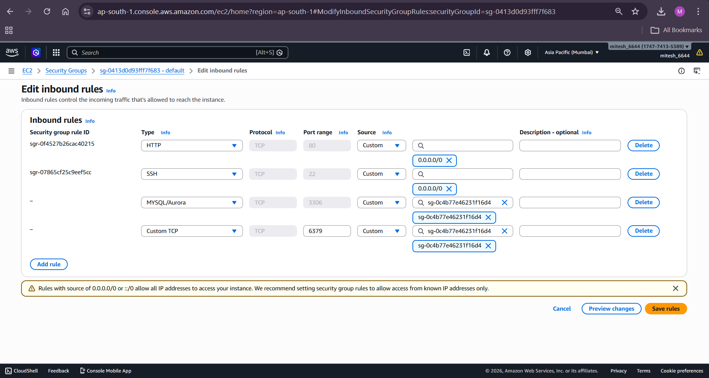

---

# 💻 PART 3: EC2 SETUP

---

## ✅ Step 4: Connect to EC2

```bash
ssh -i key.pem ec2-user@<your-ip>
```

📸 Screenshot:
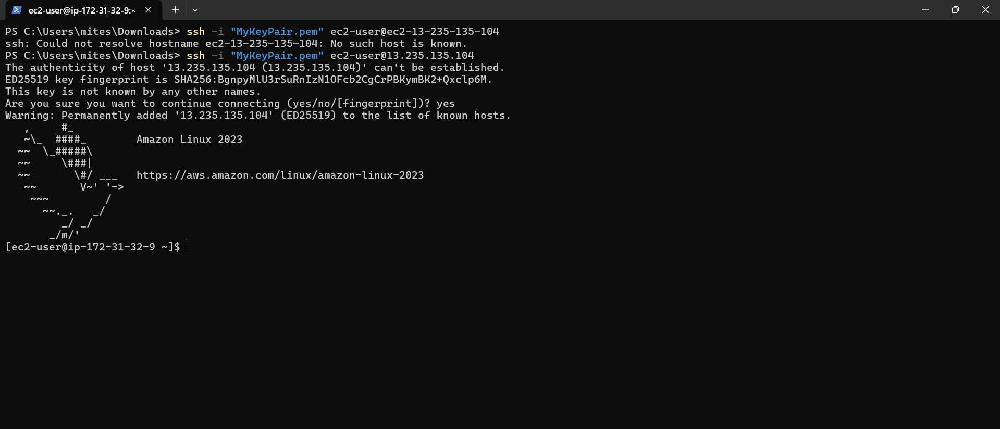

---

## ✅ Step 5: Install Python & pip

```bash
sudo yum update -y
sudo yum install python3-pip -y
```

📸 Screenshot:
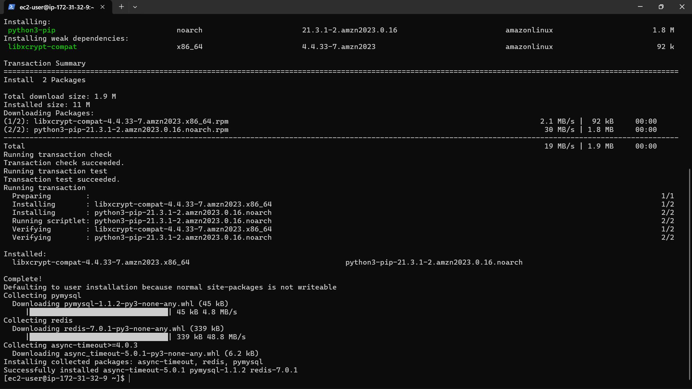

---

## ✅ Step 6: Install Python Dependencies

```bash
pip3 install pymysql redis
```

---

## ✅ Step 7: Install MySQL Client

```bash
sudo yum install mariadb105 -y
```

---

## ✅ Step 8: Install Redis CLI

```bash
sudo yum install redis6 -y
```

---

## ✅ Step 9: Download SSL Certificate

```bash
wget https://truststore.pki.rds.amazonaws.com/global/global-bundle.pem
```

📸 Screenshot:
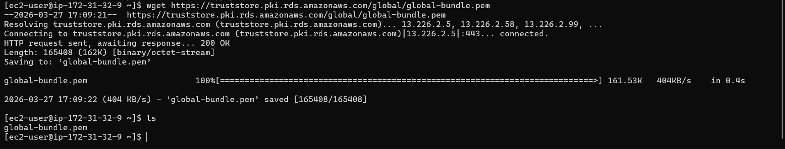

---

# 🗄️ PART 4: DATABASE SETUP

---

## ✅ Step 10: Connect to MySQL

```bash
mysql -h database-1.c18iqsyokhk5.ap-south-1.rds.amazonaws.com -u mitesh -p --ssl-ca=global-bundle.pem
```

📸 Screenshot:
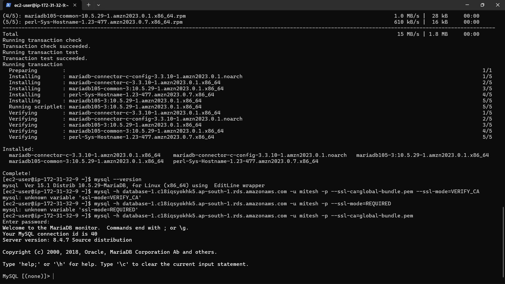

---

## ✅ Step 11: Create Database & Table

```sql
CREATE DATABASE `database-1`;
USE `database-1`;

CREATE TABLE student (
 id INT AUTO_INCREMENT PRIMARY KEY,
 name VARCHAR(50),
 dept VARCHAR(50)
);

INSERT INTO student(name,dept) VALUES
('Rahul','computer'),
('Amit','mechanical'),
('Priya','computer');
```

📸 Screenshot:
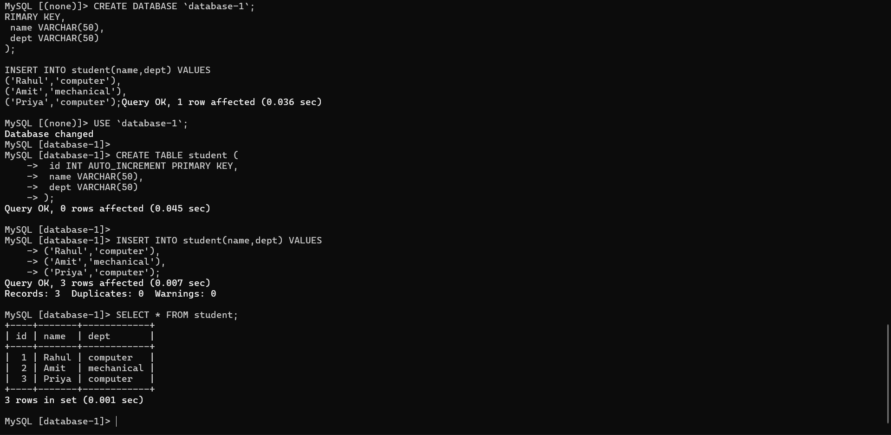

---

# 🧠 PART 5: PYTHON CACHE IMPLEMENTATION

---

## ✅ Step 12: Create Python File

```bash
nano cache_app.py
```

📸 Screenshot:
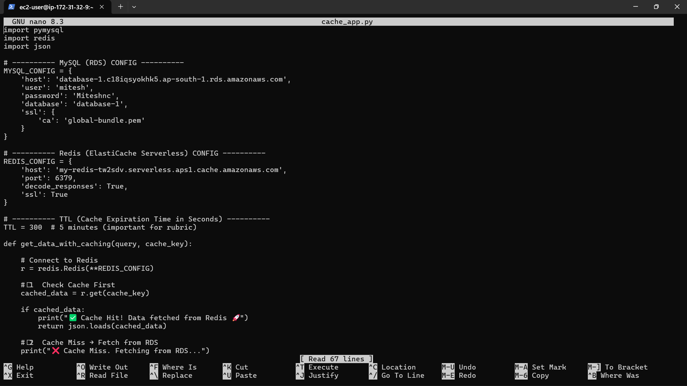

---

## ✅ Step 13: Python Code

```python
import pymysql
import redis
import json

MYSQL_CONFIG = {
    'host': 'database-1.c18iqsyokhk5.ap-south-1.rds.amazonaws.com',
    'user': 'mitesh',
    'password': 'Miteshnc',
    'database': 'database-1',
    'ssl': {'ca': 'global-bundle.pem'}
}

REDIS_CONFIG = {
    'host': 'my-redis-tw2sdv.serverless.aps1.cache.amazonaws.com',
    'port': 6379,
    'decode_responses': True,
    'ssl': True
}

TTL = 300

def get_data_with_caching(query, cache_key):
    r = redis.Redis(**REDIS_CONFIG)

    cached_data = r.get(cache_key)

    if cached_data:
        print("Cache Hit")
        return json.loads(cached_data)

    print("Cache Miss")

    connection = pymysql.connect(**MYSQL_CONFIG)

    try:
        with connection.cursor(pymysql.cursors.DictCursor) as cursor:
            cursor.execute(query)
            result = cursor.fetchall()

            r.setex(cache_key, TTL, json.dumps(result))
            return result

    finally:
        connection.close()

sql_query = "SELECT * FROM student WHERE dept='computer'"
data = get_data_with_caching(sql_query, "student:computer")
print(data)
```

---

## ✅ Step 14: Run Script

```bash
python3 cache_app.py
```

### Output:

* First run → Cache Miss
* Second run → Cache Hit

📸 Screenshots:
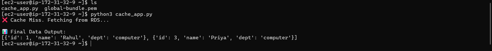
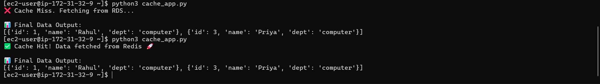

---

# 🧪 PART 6: TTL CHECK

---

## ✅ Step 15: Connect Redis

```bash
redis6-cli -h my-redis-tw2sdv.serverless.aps1.cache.amazonaws.com -p 6379 --tls
```

📸 Screenshot:
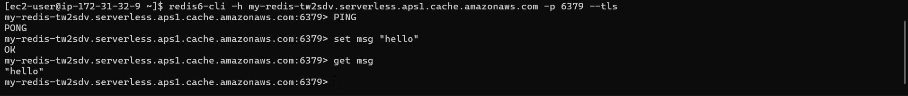

---

## ✅ Step 16: Check TTL

```bash
TTL student:computer
```

### Output:

```
(integer) 236
```

📸 Screenshot:
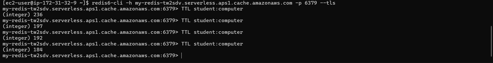

---

# 📦 Dependencies Used

* Python3
* pymysql
* redis
* MariaDB client
* Redis CLI

---

# 🧠 Key Concepts

* Cache-Aside Pattern
* Lazy Loading
* TTL (Cache Expiration)
* Secure DB Connection (SSL)
* Least Privilege Security

---

# 🏁 Conclusion

Redis caching reduces load on RDS and improves response time. TTL ensures cache consistency and avoids stale data.

---
